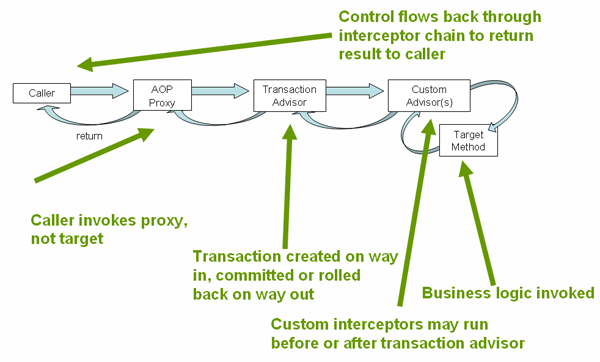

<center> ***Learning Spring*** </center>
#overview 
The Spring Framework is a lightweight solution and a potential one-stop-shop for building your enterprise-ready applications. Spring enables you to build applications from "plain old Java objects" (POJOs) and to apply enterprise services non-invasively to POJOs. The two basic core feature that Spring provides are Inversion of Control and AOP

##IoC
bean declaration 
```xml
<?xml version="1.0" encoding="UTF-8"?>
<beans xmlns="http://www.springframework.org/schema/beans" xmlns:xsi="http://www.w3.org/2001/XMLSchema-instance"
	xsi:schemaLocation="
        http://www.springframework.org/schema/beans http://www.springframework.org/schema/beans/spring-beans.xsd">

	<bean id="student" class="bean.Student" scope="prototype">
		<property name="id" value="1" />
		<property name="firstName" value="Meng" />
		<property name="lastName" value="Sun" />
	</bean>

</beans>
```

get bean 
```java
import org.springframework.context.ApplicationContext;
import org.springframework.context.support.ClassPathXmlApplicationContext;

public class Main {

    public static void main(String[] args) {
        ApplicationContext applicationContext = new ClassPathXmlApplicationContext("bean/applicationContext-beans.xml");
        Student stu = (Student) applicationContext.getBean("student");
        System.out.println(stu.getFirstName() + " " + stu.getLastName());
    }

}
```

##AOP
###Overview
AOP aims to get rid of code tangling and scattering.

###Terms in AoP:
* JoinPoint: A joinpoint is a point in the execution of the **application** where an aspect can be plugged in. This point could be a method being called, an exception being thrown, or even a field being modified.  
* PointCut:  A pointcut definition matches one or more joinpoints at which advice should be woven.
* Advice: the functionality we want to apply
* Aspect: combines pointcut and advice
* Weaving: The process of appling an aspect to our system. linking aspects with other application types or objects to create an advised object. This can
be done at compile time (using the AspectJ compiler, for example), load time, or at runtime. Spring AOP, like other pure Java AOP frameworks, performs weaving at runtime.

###Advice Types:  

* Before
* After
* AfterReturning
* Around

###Best Practices  
Define pointcut which matches all the method executions in AccountService. The execution expression are in format: execution(modifiers-pattern? ret-type-pattern declaring-type-pattern?name-pattern(param-pattern)
throws-pattern?)
```xml
<aop:pointcut id="accountExecution" expression="execution(* aop.AccountService.*(..))" />
```
Define an advice bean that profiles the method execution
```java
import org.aspectj.lang.ProceedingJoinPoint;
import org.springframework.util.StopWatch;

public class SimpleProfiler {
    public Object profile(ProceedingJoinPoint call) throws Throwable {
        StopWatch clock = new StopWatch("Profiling for " + call.getSignature().getName());
        try{
            clock.start(call.toShortString());
            return call.proceed();
        }finally{
            clock.stop();
            System.out.println(clock.prettyPrint());
        }
        
    }
}

```

```xml
<bean id="simpleProfiler" class="aop.SimpleProfiler" />
```

Declare the (advice) bean as an around advice
```xml
<aop:around pointcut-ref="accountExecution" method="profile" />
```
Aspect configration:
```xml
<aop:config>
        <aop:aspect ref="simpleProfiler">
            <aop:pointcut id="accountExecution" expression="execution(* aop.AccountService.*(..))" />
            <aop:around pointcut-ref="accountExecution" method="profile" />
        </aop:aspect>
</aop:config>
```

###Appling advice: 
Runtimie Weaving

###Advice ordering:  
When multiple advice needs to execute at the same join point (executing method) the ordering rules are:
The highest precedence advice runs first "on the way in" (so given two pieces of before advice, the one with highest precedence runs first). "On the way out" from a join point, the highest precedence advice runs last (so given two pieces of after advice, the one with the highest precedence will run second).

###Introduction:
Introductions (known as inter-type declarations in AspectJ) enable an aspect to declare that advised objects implement a given interface, and to provide an implementation of that interface on behalf of those objects. In other words, An introduction allows you to add/declare new methods or attributes to the existing classes.
e.g. There is a requirement to expose services invocation statistics, we can do it in this way:

* Add an interface UsageTracked(the implementation of that interface DefaultUsageTracked) to service under aop.introduction.AccountService, the interface should have method ``` usageTracked.incrementUseCount(); ```
* Declare advice bean to intercept all the method execution of AccountService which implements UsageTracked. The advice bean should have a method: ``` public void recordUsage(UsageTracked usageTracked) {        usageTracked.incrementUseCount();} ```

* During runtime, everytime methods in AccountServcie is invoked, it will be intercepted by advice usageTracking which will invoke ``` usageTracked.incrementUseCount(); ``` that added to AccountService

 
configuration:
```xml
<?xml version="1.0" encoding="UTF-8"?>
<beans xmlns="http://www.springframework.org/schema/beans" xmlns:xsi="http://www.w3.org/2001/XMLSchema-instance"
    xmlns:aop="http://www.springframework.org/schema/aop"
    xsi:schemaLocation="
        http://www.springframework.org/schema/beans http://www.springframework.org/schema/beans/spring-beans.xsd
        http://www.springframework.org/schema/aop http://www.springframework.org/schema/aop/spring-aop.xsd">


    <bean id="accountService" class="aop.introduction.AccountService" />
    <bean id="usageTracking" class="aop.introduction.UsageTracking" />
    <aop:aspectj-autoproxy />
    <aop:config>
        <aop:aspect id="usageTrackerAspect" ref="usageTracking">
            <aop:declare-parents types-matching="aop.introduction.AccountService" implement-interface="aop.introduction.UsageTracked" default-impl="aop.introduction.UsageTrackedImpl" />
            <aop:pointcut expression="execution(* aop.introduction.AccountService.*(..)) and this(usageTracked)" id="accountExecution" />
            <aop:before method="recordUsage" pointcut-ref="accountExecution" />
        </aop:aspect>
    </aop:config>
</beans>
```

```java
public interface UsageTracked {
    public void incrementUseCount();
}
```

```java
public class UsageTrackedImpl implements UsageTracked {

    @Override
    public void incrementUseCount() {
        System.out.println("Usage count increase by 1");
    }

}

```

```java
public class UsageTracking {
    public void recordUsage(UsageTracked usageTracked) {
        usageTracked.incrementUseCount();
    }
}

```


```java
public class Main {

    public static void main(String[] args) throws Exception {
        ApplicationContext applicationContext = new ClassPathXmlApplicationContext("aop/aop-introduction.xml");
        AccountService accountService = (AccountService) applicationContext.getBean("accountService");
        System.out.println(accountService.getBalance("622021234567"));
        accountService.transfer("1234", "abcd", 11);

    }

}
```
##Transaction Management
###Database Tx
A database transaction is a sequence of actions that are treated as a single unit of work. These actions should either complete entirely or take no effect at all. Transaction management is an important part of RDBMS-oriented enterprise application to ensure data integrity and consistency. The concept of transactions can be described with the following four key properties described as ACID −

* Atomicity − A transaction should be treated as a single unit of operation, which means either the entire sequence of operations is successful or unsuccessful.

* Consistency − This represents the consistency of the referential integrity of the database, unique primary keys in tables, etc.

* Isolation − There may be many transaction processing with the same data set at the same time. Each transaction should be isolated from others to prevent data corruption.

* Durability − Once a transaction has completed, the results of this transaction have to be made permanent and cannot be erased from the database due to system failure.

A real RDBMS database system will guarantee all four properties for each transaction. The simplistic view of a transaction issued to the database using SQL is as follows −

1. Begin the transaction using begin transaction command.

2. Perform various deleted, update or insert operations using SQL queries.

3. If all the operation are successful then perform commit otherwise rollback all the operations.

###Spring TX
Spring framework provides an abstract layer on top of different underlying transaction management APIs. The key to the Spring transaction abstraction is the notion of a transaction strategy. A transaction strategy is defined by the ```org.springframework.transaction.PlatformTransactionManager``` interface: 

 
The Spring Framework neither impelments any transaction monitor nor tries to directly manage transactions. Instead, it delegates to the underlying transaction implementation through an abstraction called a *platform transaction manager*. There are transaction manager implementations for most of the widely used platforms-JDBC, object-relational mapping such as Hibernate and TopLink, JTA, JCA, and all major application servers.
```java
public interface PlatformTransactionManager {

    TransactionStatus getTransaction(
            TransactionDefinition definition) throws TransactionException;

    void commit(TransactionStatus status) throws TransactionException;

    void rollback(TransactionStatus status) throws TransactionException;
}
```
The ```getTransaction(..)``` method returns a ```TransactionStatus``` object, depending on a ```TransactionDefinition``` parameter. The returned ```TransactionStatus``` might represent a new transaction, or can represent an existing transaction if a matching transaction exists in the current call stack. The implication in this latter case is that, as with Java EE transaction contexts, a TransactionStatus is associated with a thread of execution.

The ```TransactionDefinition``` interface specifies:

* Isolation: The degree to which this transaction is isolated from the work of other transactions. For example, can this transaction see uncommitted writes from other transactions?
* Propagation: Typically, all code executed within a transaction scope will run in that transaction. However, you have the option of specifying the behavior in the event that a transactional method is executed when a transaction context already exists. For example, code can continue running in the existing transaction (the common case); or the existing transaction can be suspended and a new transaction created. etc.
* Timeout: How long this transaction runs before timing out and being rolled back automatically by the underlying transaction infrastructure.
* Read-only status: A read-only transaction can be used when your code reads but does not modify data. Read-only transactions can be a useful optimization in some cases, such as when you are using Hibernate.

The ```TransactionStatus``` interface provides a simple way for transactional code to control transaction execution and query transaction status. The concepts should be familiar, as they are common to all transaction APIs:

```java
public interface TransactionStatus extends SavepointManager {

    boolean isNewTransaction();

    boolean hasSavepoint();

    void setRollbackOnly();

    boolean isRollbackOnly();

    void flush();

    boolean isCompleted();

}
```

####Synchronizing resources with transactions
How Transaction Managers are linked to related resources that need to be synchronized to transactions (for example ```DataSourceTransactionManager``` to a JDBC DataSource, ```HibernateTransactionManager``` to a Hibernate SessionFactory, and so forth). This section describes how the application code, directly or indirectly using a persistence API such as JDBC, Hibernate, or JDO, ensures that these resources are created, reused, and cleaned up properly. The section also discusses how transaction synchronization is triggered (optionally) through the relevant PlatformTransactionManager.

##### High-level synchronization approach
The preferred approach is to use Spring’s highest level template based persistence integration APIs or to use native ORM APIs with transaction- aware factory beans or proxies for managing the native resource factories. 

#####Low-level synchronization approach
Classes such as DataSourceUtils (for JDBC), EntityManagerFactoryUtils (for JPA), SessionFactoryUtils (for Hibernate), PersistenceManagerFactoryUtils (for JDO), and so on exist at a lower level. When you want the application code to deal directly with the resource types of the native persistence APIs, you use these classes to ensure that proper Spring Framework-managed instances are obtained, transactions are (optionally) synchronized, and exceptions that occur in the process are properly mapped to a consistent API.

#####TransactionAwareDataSourceProxy
At the very lowest level exists the TransactionAwareDataSourceProxy class. This is a proxy for a target DataSource, which wraps the target DataSource to add awareness of Spring-managed transactions. In this respect, it is similar to a transactional JNDI DataSource as provided by a Java EE server.


####JDBC Transactions
The DataSourceTransactionManager handles all the transactional requirements if straight JDBC or Spring DAO is eing used in the application.  The DatasourceTransaction Manager works with a javax.sql.DataSource object. It ensures that the same Connection object is retrieved from the Datasource and used in a transction. If the transaction is successfully, the commit method is invoked on the Connection object. If the transaction is a failure, the rollback method will beused. In short, this transaction manger delegates the actual transaction processing to the database.


####programmatic transaction management VS Declarative transaction management
Spring provides consistent programming model in any environment from local transaction and global transaction.  

* With programmatic transaction management, developers work with the Spring Framework transaction abstraction, which can run over any underlying transaction infrastructure.  
* With the preferred declarative model, developers typically write little or no code related to transaction management and This option has the least impact on application code, and hence is most consistent with the ideals of a non-invasive lightweight container. The Spring Framework’s declarative transaction management is made possible with Spring aspect-oriented programming (AOP)

#####Spring Framework’s declarative transaction implementation
The combination of AOP with transactional metadata yields(生成) an AOP proxy that uses a TransactionInterceptor in conjunction with an appropriate PlatformTransactionManager implementation to drive transactions around method invocations



How to use declaractive transaction :

* define service bean which methods execution will be run in a transaction
* define the datasource with connection properties
* define the platform implementation of transaction manager
* define the the template for data access operation
* define the transaction advice with transaction configuration(isolation and propagation)
* define the pointcut to match the method execution in service bean
* bind the pointcut with transaction advice


```xml
<?xml version="1.0" encoding="UTF-8"?>
<beans xmlns="http://www.springframework.org/schema/beans" xmlns:xsi="http://www.w3.org/2001/XMLSchema-instance"
       xmlns:aop="http://www.springframework.org/schema/aop" xmlns:tx="http://www.springframework.org/schema/tx"
       xsi:schemaLocation="
        http://www.springframework.org/schema/beans
        http://www.springframework.org/schema/beans/spring-beans.xsd
        http://www.springframework.org/schema/tx
        http://www.springframework.org/schema/tx/spring-tx.xsd
        http://www.springframework.org/schema/aop
        http://www.springframework.org/schema/aop/spring-aop.xsd">

    <!-- this is the service object that we want to make transactional -->
    <bean id="empService" class="org.meng.spring.tx.declarative.EmpServiceImpl"/>

    <bean id="namedJdbcTemplate" class="org.springframework.jdbc.core.namedparam.NamedParameterJdbcTemplate">
        <constructor-arg name="dataSource" ref="dataSource"/>
    </bean>

    <!-- the transactional advice (what 'happens'; see the <aop:advisor/> bean below) -->
    <tx:advice id="txAdvice" transaction-manager="txManager">
        <!-- the transactional semantics... -->
        <tx:attributes>
            <!-- all methods starting with 'get' are read-only -->
            <tx:method name="get*" isolation="DEFAULT" propagation="SUPPORTS" read-only="true"/>
            <!-- other methods use the default transaction settings (see below) -->
            <tx:method name="*"/>
        </tx:attributes>
    </tx:advice>

    <!-- ensure that the above transactional advice runs for any execution of an operation defined by the EmpService interface -->
    <aop:config>
        <aop:pointcut id="empServiceOperation"
                      expression="execution(* org.meng.spring.tx.declarative.EmpServiceImpl.*(..))"/>
        <aop:advisor advice-ref="txAdvice" pointcut-ref="empServiceOperation"/>
    </aop:config>

    <!-- don't forget the DataSource -->
    <bean id="dataSource" class="org.springframework.jdbc.datasource.DriverManagerDataSource">
        <property name="driverClassName" value="com.mysql.jdbc.Driver"/>
        <property name="url" value="jdbc:mysql://localhost:3306/learningspring"/>
        <property name="username" value="root"/>
        <property name="password" value="root"/>
    </bean>

    <!-- similarly, don't forget the PlatformTransactionManager -->
    <bean id="txManager" class="org.springframework.jdbc.datasource.DataSourceTransactionManager">
        <property name="dataSource" ref="dataSource"/>
    </bean>

</beans>

```

####Transaction Propagation
Spring's propagation types differ in how they behave in presence/absence of an existing transaction:

| PROPAGATION TYPE  | no current transaction                                         | there's a current transaction                                     |
|-------------------|----------------------------------------------------------------|-------------------------------------------------------------------|
| MANDATORY         | throw exception                                                | use current transaction                                           |
| NEVER             | don't create a transaction, run method outside any transaction | throw exception                                                   |
| NOT_SUPPORTED     | don't create a transaction, run method outside any transaction | suspend current transaction, run method outside any transaction   |
| SUPPORTS          | don't create a transaction, run method outside any transaction | use current transaction                                           |
| REQUIRED(default) | create a new transaction                                       | use current transaction                                           |
| REQUIRES_NEW      | create a new transaction                                       | suspend current transaction, create a new independent transaction |
| NESTED            | create a new transaction                                       | create a new nested transaction                                   |

As for propagation types, REQUIRED/MANDATORY/SUPPORTS would be used when you want your code to be part of the current transaction, sharing its commit/rollback fate; NESTED would come into use in cases where you want to be able to rollback only parts of a bigger transaction; and finally REQUIRES_NEW is to be used when you want to do something totally unrelated to the current transaction.  
The difference between REQUIRED, MANDATORY and SUPPORTS strives in how they behave when there is no existing transaction. MANDATORY acts as a sort of assert directive, ensuring there is an opened transaction. REQUIRED creates a new transaction, being safe to use outside any transaction. SUPPORTS rides along an existing transaction, but doesn't create a new one if none exists.

When the propagation setting is PROPAGATION_REQUIRED, a logical transaction scope is created for each method upon which the setting is applied. Each such logical transaction scope can determine rollback-only status individually, with an outer transaction scope being logically independent from the inner transaction scope. Of course, in case of standard PROPAGATION_REQUIRED behavior, all these scopes will be mapped to the same physical transaction. So a rollback-only marker set in the inner transaction scope does affect the outer transaction’s chance to actually commit (as you would expect it to).

However, in the case where an inner transaction scope sets the rollback-only marker, the outer transaction has not decided on the rollback itself, and so the rollback (silently triggered by the inner transaction scope) is unexpected. A corresponding UnexpectedRollbackException is thrown at that point. This is expected behavior so that the caller of a transaction can never be misled to assume that a commit was performed when it really was not. So if an inner transaction (of which the outer caller is not aware) silently marks a transaction as rollback-only, the outer caller still calls commit. The outer caller needs to receive an UnexpectedRollbackException to indicate clearly that a rollback was performed instead.

PROPAGATION_REQUIRES_NEW

PROPAGATION_REQUIRES_NEW, in contrast to PROPAGATION_REQUIRED, uses a completely independent transaction for each affected transaction scope. In that case, the underlying physical transactions are different and hence can commit or roll back independently, with an outer transaction not affected by an inner transaction’s rollback status.

Nested

PROPAGATION_NESTED uses a single physical transaction with multiple savepoints that it can roll back to. Such partial rollbacks allow an inner transaction scope to trigger a rollback for its scope, with the outer transaction being able to continue the physical transaction despite some operations having been rolled back. This setting is typically mapped onto JDBC savepoints, so will only work with JDBC resource transactions. See Spring’s DataSourceTransactionManager.


####Local and Global Tx
* Local Transaction is resource specific transaction, it cannot work across multiple transactional resources  
* Global Transaction is an application server managed transaction, allowing to work with different transactional resources (this might be two different database, database and message queue, etc)


##JDBC
With Spring JDBC, it can greatly eliminate boilerplate code when using JDBC API. Comparision between plain JDBC and Spring JDBC:

| Action                                                   | Spring | You |
|----------------------------------------------------------|--------|-----|
| Define connection parameters.                            |        | X   |
| Open the connection.                                     | X      |     |
| Specify the SQL statement.                               |        | X   |
| Declare parameters and provide parameter values          |        | X   |
| Prepare and execute the statement.                       | X      |     |
| Set up the loop to iterate through the results (if any). | X      |     |
| Do the work for each iteration.                          |        | X   |
| Process any exception.                                   | X      |     |
| Handle transactions.                                     | X      |     |
| Close the connection, statement and resultset.           | X      |     |
http://www.tablesgenerator.com/markdown_tables# 

Spring framework provides following approaches for JDBC database access:

1. JdbcTemplate is the classic Spring JDBC approach and the most popular 
2. NamedParameterJdbcTemplate wraps a JdbcTemplate to provide named parameters instead of the traditional JDBC "?" placeholders.
3. SimpleJdbcInsert and SimpleJdbcCall optimize database metadata to limit the amount of necessary configuration. This approach simplifies coding so that you only need to provide the name of the table or procedure and provide a map of parameters matching the column names.

How to do Spring JDBC
1. Configure datasource with connection parameters
```xml
<!-- the DataSource -->
<bean id="dataSource" class="org.springframework.jdbc.datasource.DriverManagerDataSource">
	<property name="driverClassName" value="com.mysql.jdbc.Driver" />
	<property name="url" value="jdbc:mysql://localhost:3306/learningspring" />
	<property name="username" value="root" />
	<property name="password" value="root" />
</bean>
```
2. build Spring JDBC template with dataSource 
```xml
<bean id="jdbcTemplate" class="org.springframework.jdbc.core.JdbcTemplate">
	<property name="dataSource" ref="dataSource" />
</bean>

```

3. call Spring JDBC template
provide: sql + parameter + resultset callback handler
```java
public class EmpDao {
	private JdbcTemplate jdbcTemplate;
	//query
	public Emp getEmpById(long empNo) {
		return jdbcTemplate.query("select * from emp where emp_no = " + empNo, new ResultSetExtractor<Emp>() {
			@Override
			public Emp extractData(ResultSet rs) throws SQLException {
				rs.next();
				Emp emp = new Emp();
				emp.setEmpNo(rs.getLong("emp_no"));
				emp.setFirstName(rs.getString("first_name"));
				emp.setLastName(rs.getString("last_name"));
				return emp;
			}
		});
	}
	//update
    public void updateEmpName(Emp emp) {
		jdbcTemplate.update("update emp set first_name = ?, last_name = ? where emp_no = ?", emp.getFirstName(),
				emp.getLastName(), emp.getEmpNo());
	}	
	
	//execute(..) method to execute any arbitrary SQL, and as such the method is often used for DDL statements.
	public void createBakupTable(){
	    jdbcTemplate.execute("create table emp_bakup like emp");
    }
	
    //execute procedure
	public Map<String, Object> getPagedEmp(final int pageIdx, final int pageSize){
		//create procedure getPagedEmp (IN startIdx int, IN pageSize int, OUT totalCount int, OUT totalPage int)
        //The order of namedParameters should be the same to the procedure's parameters order
	    List<SqlParameter> params = new ArrayList<>();
		params.add(new SqlParameter("startIdx", Types.INTEGER));
		params.add(new SqlParameter("pageSize", Types.INTEGER));
				params.add(new SqlOutParameter("totalPage1", Types.INTEGER));

		params.add(new SqlOutParameter("totalCount", Types.INTEGER));
		params.add(new SqlReturnResultSet("empList", new EmpRowMapper()));
		Map<String, Object> resultMap = jdbcTemplate.call(new CallableStatementCreator() {
			@Override
			public CallableStatement createCallableStatement(Connection con) throws SQLException {
				CallableStatement call =  con.prepareCall("{call getPagedEmp(?,?,?,?)}");
				call.setInt("startIdx", pageIdx);
				call.setInt("pageSize", pageSize);
				call.registerOutParameter("totalCount",Types.INTEGER);
				call.registerOutParameter("totalPage1", Types.INTEGER);
				return call;
			}
		}, params);

		return resultMap;
	}
	
}
```

###JDBC batches


//* * *

###schema-based AOP
https://docs.spring.io/spring/docs/current/spring-framework-reference/html/aop.html
